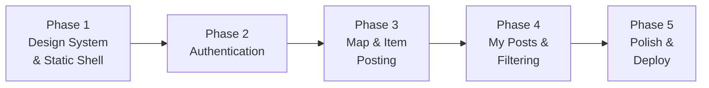

# Lost & Found — Execution Plan

> A neumorphic, map-centric web app where users report lost or found items pinned to real-world locations.

---

## Tech Stack Overview

| Layer | Technology |
|---|---|
| Framework | **Next.js 16** (App Router) |
| Language | TypeScript |
| Styling | **Tailwind CSS v4** (with custom neumorphic utilities) |
| Database | **Neon PostgreSQL** (serverless) |
| ORM | **Prisma** (with `@prisma/adapter-neon` + `@neondatabase/serverless`) |
| Auth | Custom JWT sessions (jose + bcryptjs) — no external auth library |
| Map | **Leaflet** + **react-leaflet** (free, no API key needed) |
| Validation | **Zod** |
| Font | **Inter** (via `next/font/google`) |

---

## Color Palette — Red × Beige Neumorphism

| Token | Value | Usage |
|---|---|---|
| `--bg-base` | `#E8DED5` | Page background (warm beige) |
| `--bg-raised` | `#F2EBE3` | Card / raised surfaces |
| `--shadow-light` | `#FFFAF5` | Light neumorphic shadow |
| `--shadow-dark` | `#C9BFB6` | Dark neumorphic shadow |
| `--accent` | `#C0392B` | Primary red (buttons, active states) |
| `--accent-hover` | `#A93226` | Hover/pressed red |
| `--accent-soft` | `#E8D5D2` | Soft red tint for "Lost" badges |
| `--success-soft` | `#D5E8D7` | Soft green tint for "Found" badges |
| `--text-primary` | `#3B2F2F` | Dark brown body text |
| `--text-secondary` | `#7A6E6E` | Muted labels |
| `--text-on-accent` | `#FFFFFF` | White text on accent buttons |

Neumorphic style is achieved with **dual box-shadows** (light top-left, dark bottom-right) on the beige background. Pressed/inset states invert the shadows.

---

## Phase 1 — Design System & Static Shell

### Goal
Establish the neumorphic design system, global layout, and static (non-functional) versions of every page so the overall look-and-feel is locked in.

### Tasks

#### 1.1 — Global Design Tokens & CSS
- **File:** `app/globals.css`
- Define CSS custom properties for the full palette above.
- Create neumorphic utility classes: `.neu-raised`, `.neu-pressed`, `.neu-flat`, `.neu-button`.
- Import **Inter** via `next/font/google` in `layout.tsx`.
- Set `body` background to `--bg-base`, default font to Inter, text color to `--text-primary`.

#### 1.2 — Root Layout & Navbar
- **File:** `app/layout.tsx`
- SEO metadata: title "Lost & Found", description, favicon.
- Shared `<Navbar />` component with:
  - Logo/brand mark on the left.
  - Navigation links: **Map** · **My Posts** · **Login / Sign Up** (or avatar dropdown when logged in).
  - Neumorphic styling (raised bar, pill-shaped links that press on hover).

#### 1.3 — Landing / Hero Page (static)
- **File:** `app/page.tsx`
- Full-viewport hero with a bold headline, tagline, and two CTA buttons:
  - "I Lost Something" (outlined red)
  - "I Found Something" (filled red)
- Subtle CSS animation (floating pin icon or pulsing dot).
- Below fold: quick "How it works" 3-step section with neumorphic cards.

#### 1.4 — Auth Pages (static UI only)
- **Files:** `app/(auth)/login/page.tsx`, `app/(auth)/signup/page.tsx`
- Centered card layout with neumorphic form fields (inset shadow on focus).
- Inputs: email, password (+ name for signup).
- Toggle link between Login ↔ Sign Up.
- Submit button with micro-animation (scale on press).

#### 1.5 — Map Page (static placeholder)
- **File:** `app/map/page.tsx`
- Full-height layout with a placeholder `<div>` where the map will go.
- Side panel (collapsible on mobile) to show item details.
- Floating Action Button (FAB) in bottom-right: "Report Item".

#### 1.6 — Reusable Components
- `components/ui/Button.tsx` — Neumorphic button (variant: filled | outlined | ghost).
- `components/ui/Input.tsx` — Neumorphic text input (inset shadow).
- `components/ui/Card.tsx` — Neumorphic card wrapper.
- `components/ui/Badge.tsx` — "LOST" (red tint) / "FOUND" (green tint) badge.
- `components/ui/Modal.tsx` — Overlay modal for report form.

### Deliverable
A fully styled, navigable static app. Every page looks production-ready even though nothing talks to a database yet.

---

## Phase 2 — Authentication (Functional)

### Goal
Wire up real signup/login with Neon DB, hashed passwords, and JWT cookie sessions.

### Tasks

#### 2.1 — Prisma Setup
- Install: `prisma`, `@prisma/client`, `@prisma/adapter-neon`, `@neondatabase/serverless`.
- **File:** `prisma/schema.prisma`
  ```prisma
  datasource db {
    provider = "postgresql"
    url      = env("DATABASE_URL")
  }

  generator client {
    provider        = "prisma-client-js"
    previewFeatures = ["driverAdapters"]
  }

  model User {
    id        String   @id @default(cuid())
    name      String
    email     String   @unique
    password  String
    createdAt DateTime @default(now())
    items     Item[]
  }
  ```
- **File:** `.env` — store `DATABASE_URL` (Neon connection string, server-only).
- Run `npx prisma db push` to sync schema.
- **File:** `lib/prisma.ts` — singleton Prisma client using Neon serverless adapter.

#### 2.2 — Session Management
- Install: `jose`, `bcryptjs`, `@types/bcryptjs`, `server-only`, `zod`.
- **File:** `lib/session.ts`
  - `encrypt(payload)` / `decrypt(token)` using HS256 + `SESSION_SECRET`.
  - `createSession(userId)` — set HttpOnly cookie.
  - `getSession()` — read + verify cookie.
  - `deleteSession()` — clear cookie.
- **File:** `lib/definitions.ts` — Zod schemas for signup & login forms; `FormState` type.

#### 2.3 — Server Actions for Auth
- **File:** `app/actions/auth.ts` (`'use server'`)
  - `signup(state, formData)` → validate → hash password → create user → create session → redirect `/map`.
  - `login(state, formData)` → validate → find user → compare password → create session → redirect `/map`.
  - `logout()` → delete session → redirect `/`.

#### 2.4 — Wire Auth UI
- Update `app/(auth)/login/page.tsx` and `signup/page.tsx` to use `useActionState` with the server actions.
- Display field-level validation errors from Zod.
- Add loading spinner on submit button via `pending` from `useActionState`.

#### 2.5 — Auth Context & Protected Routes
- **File:** `components/providers/AuthProvider.tsx` (`'use client'`) — context that exposes current user info.
- **File:** `middleware.ts` — protect `/map`, `/my-posts` routes; redirect unauthenticated users to `/login`.
- Navbar dynamically shows user avatar or login link.

### Deliverable
Users can sign up, log in, and log out. Sessions persist across page reloads. Protected pages redirect to login if unauthenticated.

---

## Phase 3 — Interactive Map & Item Posting

### Goal
Full map experience with Leaflet: browse pins, click to see details, and post new lost/found items by picking a location on the map.

### Tasks

#### 3.1 — Database Schema for Items
- Extend `prisma/schema.prisma`:
  ```prisma
  model Item {
    id          String   @id @default(cuid())
    type        String   // "LOST" | "FOUND"
    title       String
    description String
    category    String   // e.g. "Electronics", "Keys", "Wallet", "Pet", "Other"
    imageUrl    String?
    latitude    Float
    longitude   Float
    locationName String? // reverse-geocoded or user-typed
    date        DateTime // when lost/found
    resolved    Boolean  @default(false)
    createdAt   DateTime @default(now())
    updatedAt   DateTime @updatedAt
    userId      String
    user        User     @relation(fields: [userId], references: [id])
  }
  ```
- Run `npx prisma db push`.

#### 3.2 — Leaflet Map Integration
- Install: `leaflet`, `react-leaflet`, `@types/leaflet`.
- **File:** `components/map/MapView.tsx` (`'use client'`)
  - Render full-screen `<MapContainer>` with OpenStreetMap tiles.
  - Custom map pin icons: red pin for LOST, green pin for FOUND.
  - Cluster markers when zoomed out (via `react-leaflet-cluster` or manual).
  - On marker click → open popup with item summary + "View Details" link.
- **File:** `components/map/LocationPicker.tsx` (`'use client'`)
  - Click-on-map to drop a pin for selecting report location.
  - Shows lat/lng and optional reverse-geocoded address.

#### 3.3 — Report Item Form
- **File:** `components/map/ReportItemModal.tsx` (`'use client'`)
  - Modal form with neumorphic styling.
  - Fields: Type (LOST/FOUND toggle), Title, Description, Category (dropdown), Date, optional image upload (stored as base64 or external URL for now).
  - Location auto-filled from the pin dropped on the map.
  - Submits via server action.

#### 3.4 — Server Actions & API for Items
- **File:** `app/actions/items.ts` (`'use server'`)
  - `createItem(formData)` — validate with Zod, insert into DB, revalidate map page.
  - `getItems(filters?)` — fetch items with optional filters (type, category, bounds).
  - `getItemById(id)` — fetch single item details.
  - `resolveItem(id)` — mark as resolved (owner only).
  - `deleteItem(id)` — delete (owner only).

#### 3.5 — Map Page Assembly
- **File:** `app/map/page.tsx` (Server Component)
  - Fetch all items server-side, pass to client `<MapView>`.
  - Sidebar (or bottom sheet on mobile) for item detail view.
  - FAB opens `<ReportItemModal>`.
  - URL search params for selected item (`?item=<id>`).

#### 3.6 — Item Detail Panel
- **File:** `components/map/ItemDetailPanel.tsx`
  - Shows full item info: title, description, image, category, date, reporter name.
  - "Mark as Resolved" button (visible to owner only).
  - "Contact Reporter" placeholder (can be expanded later).

### Deliverable
Users can browse a live map with lost/found pins, click pins to see details, drop a pin to report a new item, and see their reports appear in real-time.

---

## Phase 4 — My Posts, Filtering & Search

### Goal
Personal dashboard and powerful filtering so users can find what they need.

### Tasks

#### 4.1 — My Posts Page
- **File:** `app/my-posts/page.tsx`
  - Grid of neumorphic cards showing user's own items.
  - Tabs: "All" · "Lost" · "Found" · "Resolved".
  - Each card has Edit / Delete / Mark Resolved actions.
  - Empty state with illustration.

#### 4.2 — Map Filters
- **File:** `components/map/FilterBar.tsx` (`'use client'`)
  - Neumorphic toggle buttons: Show Lost / Show Found / Show All.
  - Category filter dropdown.
  - Date range filter (last 24h, last week, last month, all time).
  - Search bar to filter by title/description keyword.
- Filters update URL search params; map re-fetches or client-side filters.

#### 4.3 — Responsive Design Polish
- Ensure mobile-first layout:
  - Map takes full screen on mobile, filters in a collapsible top bar.
  - Side panel becomes bottom sheet on small screens.
  - Navbar collapses to hamburger menu.
- Test across breakpoints: 375px, 768px, 1024px, 1440px.

#### 4.4 — Edit Item Flow
- **File:** `components/map/EditItemModal.tsx`
  - Pre-filled form with existing item data.
  - Server action: `updateItem(id, formData)`.

### Deliverable
Users have full CRUD on their items, can filter the map by type/category/date/keyword, and the app works beautifully on mobile.

---

## Phase 5 — Polish, Performance & Deployment Prep

### Goal
Final refinements, performance optimization, and deployment readiness.

### Tasks

#### 5.1 — Animations & Micro-interactions
- Page transitions with subtle fade-in.
- Button press animations (scale + shadow shift for neumorphic feel).
- Map marker drop animation.
- Skeleton loading states for cards and map.
- Toast notifications for success/error (item posted, login failed, etc.).

#### 5.2 — Error Handling & Edge Cases
- Global error boundary (`app/error.tsx`).
- Not found page (`app/not-found.tsx`) with neumorphic styling.
- Form validation error display improvements.
- Handle map geolocation permission (auto-center on user location if allowed).
- Handle empty states gracefully everywhere.

#### 5.3 — SEO & Metadata
- Dynamic metadata for each page.
- Open Graph images.
- Proper heading hierarchy (single `<h1>` per page).
- Semantic HTML (`<main>`, `<nav>`, `<article>`, `<section>`).

#### 5.4 — Security Hardening
- Ensure `DATABASE_URL` and `SESSION_SECRET` are **never** exposed to client code (no `NEXT_PUBLIC_` prefix).
- Rate limiting on auth endpoints (optional — can use middleware or external).
- Input sanitization in all server actions.
- CSRF protection via SameSite cookies.

#### 5.5 — Performance
- Image optimization via `next/image` where applicable.
- Lazy-load map component (dynamic import with `next/dynamic`).
- Minimize client-side JS: keep heavy logic in server components.
- Database query optimization with Prisma `select` / `include`.

#### 5.6 — Deployment
- Verify `next build` succeeds with no errors.
- Test with `next start` locally.
- Prepare for Vercel deployment (env vars in dashboard).
- Write a `README.md` with setup instructions.

### Deliverable
A production-grade, performant, accessible app ready for deployment.

---

## File Structure (Final)

```
lost-and-found/
├── app/
│   ├── (auth)/
│   │   ├── login/page.tsx
│   │   └── signup/page.tsx
│   ├── actions/
│   │   ├── auth.ts
│   │   └── items.ts
│   ├── api/             (route handlers if needed)
│   ├── map/
│   │   └── page.tsx
│   ├── my-posts/
│   │   └── page.tsx
│   ├── error.tsx
│   ├── globals.css
│   ├── layout.tsx
│   ├── not-found.tsx
│   └── page.tsx          (landing/hero)
├── components/
│   ├── map/
│   │   ├── MapView.tsx
│   │   ├── LocationPicker.tsx
│   │   ├── ReportItemModal.tsx
│   │   ├── EditItemModal.tsx
│   │   ├── ItemDetailPanel.tsx
│   │   └── FilterBar.tsx
│   ├── providers/
│   │   └── AuthProvider.tsx
│   └── ui/
│       ├── Badge.tsx
│       ├── Button.tsx
│       ├── Card.tsx
│       ├── Input.tsx
│       ├── Modal.tsx
│       └── Navbar.tsx
├── lib/
│   ├── definitions.ts
│   ├── prisma.ts
│   └── session.ts
├── prisma/
│   └── schema.prisma
├── middleware.ts
├── .env                  (DATABASE_URL, SESSION_SECRET — gitignored)
└── ...config files
```

---

## Phase Execution Order



> Each phase builds on the previous. I'll implement one phase at a time and you can review/test before we move to the next.

---

## Open Questions

> [!IMPORTANT]
> **Image uploads**: For item images, should we use a simple base64-in-database approach (quick but limited), or integrate an external storage service like Cloudinary/S3? I'll default to optional image URL field for now.

> [!IMPORTANT]
> **Contact system**: Should reporters be contactable? Options include: showing their email, an in-app messaging system, or just displaying the reporter's name. I'll keep it simple (show name only) unless you want more.

> [!NOTE]
> **Geolocation**: The app will request browser geolocation to auto-center the map. If denied, it defaults to a configurable location (e.g., Kathmandu). Let me know if you'd prefer a different default.
